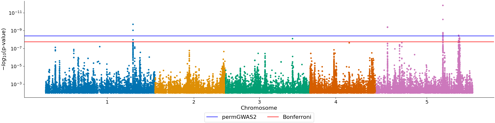
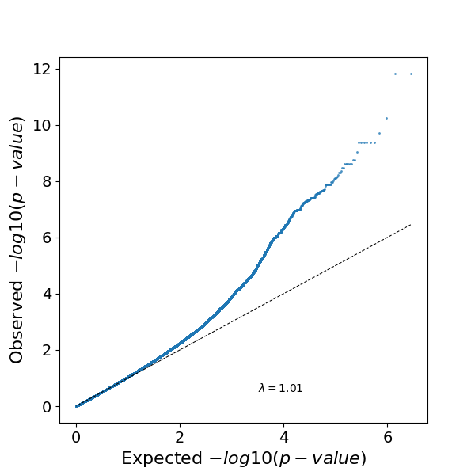

# Create plots

permGWAS is able to create Manhattan and QQ-plots during a GWAS run and form existing p-value files via the 
`create_plot.py` script.

## Manhattan plot


- While running permGWAS, you can use the flag `-mplot` to generate and save a Manhattan plot with Bonferroni 
significance threshold for significance level $\alpha=0.05$. If you use permGWAS2 with permutations, additionally the 
permutation-based threshold will be plotted.
- If you already have result files generated by permGWAS, you can also create a Manhattan plot afterward. You only need 
to specify the p-value file (relative or absolute path) and use the flag `-mplot`:
```shell
python3 create_plot.py -p_val PATH_TO_RESULT_P_VALUE_FILE -mplot
```
- By default, it uses a significance level of 5%. You can change it via the flag `-sig_level`, which expects an integer 
value, e.g. 
```shell
python3 create_plot.py -p_val PATH_TO_RESULT_P_VALUE_FILE -mplot -sig_level 1
```
- If you have a corresponding minimal p-value file available, you can additionally plot the permutation-based significance 
threshold by giving the path to the file via the flag `-min_p_val`:
```shell
python3 create_plot.py -p_val PATH_TO_RESULT_P_VALUE_FILE -min_p_val PATH_TO_MIN_P_VALUE_FILE -mplot
```
- The resulting Manhattan plot will be saved in the same folder where the p-value file is stored, unless you specify a 
different directory via `-out_dir`. If no other name is specified via `-out_file`, the plot will be named 
`manhattan_PHENOTYPE_NAME.png`. 


### QQ-plot


- While running permGWAS, you can use the flag `-qqplot` to generate and save a simple QQ-plot including the inflation 
factor lambda.
- To generate a QQ-plot afterward based on existing p-value result files, you only need to specify the p-value file 
(relative or absolute path) and use the flag `-qqplot`:
```shell
python3 create_plot.py -p_val PATH_TO_RESULT_P_VALUE_FILE -qqplot
```
- The resulting QQ-plot will be saved in the same folder where the p-value file is stored, unless you specify a 
different directory via `-out_dir`. If no other name is specified via `-out_file`, the plot will be named 
`qq_plot_PHENOTYPE_NAME.png`. 